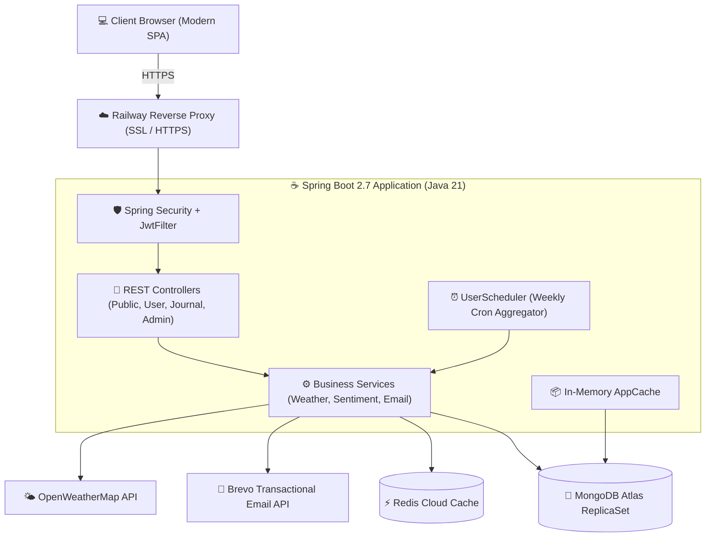

<div align="center">

# 🖋️ Inkwell — Enterprise Journal & Analytics Platform

[](https://openjdk.org/projects/jdk/21/)
[](https://spring.io/projects/spring-boot)
[](https://www.mongodb.com/atlas)
[](https://redis.io/)
[](https://www.docker.com/)
[](https://railway.app/)
[](LICENSE)

<p align="center">
  <b>A modern, cloud-native RESTful journaling engine engineered with enterprise-grade security, multi-tier distributed caching, automated sentiment analytics, and responsive transactional communications.</b>
</p>

[🌐 **Live Demo**](https://inkwell-production-4cdb.up.railway.app) • [📖 **Swagger Documentation**](https://inkwell-production-4cdb.up.railway.app/swagger-ui/index.html) • [🐛 **Report Bug**](https://github.com/VarmaSahil04/InkWell/issues) • [✨ **Request Feature**](https://github.com/VarmaSahil04/InkWell/issues)

---

</div>

## 🌟 Executive Summary

**Inkwell** is designed for modern personal logging with cloud reliability. Beyond standard CRUD operations, Inkwell implements production-grade backend design patterns:
- **Stateless Authentication**: Zero-session JWT verification with custom filters and Spring Security.
- **Cache-Aside Pattern**: Low-latency responses via Redis with automated TTL expiration and graceful fallback.
- **Distributed Scheduled Tasks**: Weekly cron aggregators calculating rolling emotional sentiment shifts with automated HTML email dispatch.
- **Multi-Stage Containerization**: Minimized Alpine container footprint running on Eclipse Temurin 21 JRE with non-root security principles.

---

## 🏗️ System Architecture



---

## 🚀 Key Engineering Features

### 1. 🛡️ Enterprise Security & Stateless Identity
- **JWT Authentication Architecture**: Intercepts every inbound request with a custom [`JwtFilter`](src/main/java/net/engineeringdigest/journalApp/Filter/JwtFilter.java), validating claims before reaching `DispatcherServlet`.
- **Cryptographic Password Hashing**: Passwords stored using industry-standard `BCryptPasswordEncoder` with salted hashing.
- **Role-Based Access Control (RBAC)**: Fine-grained authorizations separating `USER` and `ADMIN` privileges.
- **Secure Password Recovery Pipeline**: 15-minute cryptographically generated UUID tokens, delivered via responsive HTML emails with reverse-proxy dynamic origin detection.

### 2. ⚡ Distributed Multi-Tier Caching
- **Redis Cache-Aside**: High-frequency endpoints (such as weather and dynamic metadata) query Redis first before hitting third-party APIs.
- **Resilient Fallback**: If Redis connectivity drops, the system seamlessly bypasses the cache without throwing 500 errors to end users.
- **Automated Memory Synchronization**: `@Scheduled` tasks refresh internal metadata cache layers periodically to prevent stale state.

### 3. 📊 Scheduled Sentiment Analytics Engine
- A dedicated background worker executes weekly cron jobs (`0 0 9 * * SUN`).
- Performs temporal sliding-window analysis on user journal entries over a **7-day rolling window**.
- Leverages Java Stream collectors and frequency mapping algorithms to summarize emotional trends and sends automated weekly wellness summaries via Brevo.

### 4. 🐳 Production DevOps & Containerization
- **Multi-Stage Dockerfile**: Isolates Maven 3.9.9 build environment from the production runtime, resulting in a lightweight deployment image under 200MB.
- **Non-Root Execution**: Runs under a dedicated `spring:spring` system user for container security.
- **Zero-Secret Codebase**: 100% of sensitive credentials (MongoDB, Redis, API keys, JWT secrets) are dynamically injected via environment variables.

---

## 🛠️ Tech Stack & Dependencies

| Layer | Technology | Purpose |
|---|---|---|
| **Core Platform** | **Java 21 (LTS)** | Modern language features, Virtual Thread readiness |
| **Framework** | **Spring Boot 2.7.16** | Core IOC, dependency injection, and REST controllers |
| **Security** | **Spring Security + JJWT 0.12.5** | Stateless token auth & BCrypt hashing |
| **Primary Database** | **MongoDB Atlas** | Document-oriented storage with Spring Data Mongo |
| **Distributed Cache** | **Redis Cloud (Lettuce 6.1)** | Fast in-memory key-value caching with TTLs |
| **Email Gateway** | **Brevo (Sendinblue) REST API** | Transactional HTML email delivery |
| **API Documentation** | **SpringDoc OpenAPI 3.0 / Swagger** | Interactive UI and OpenAPI specification |
| **Data Parsing** | **OpenCSV 5.8 & Jackson JSR310** | Efficient CSV processing and ISO-8601 timestamps |
| **Testing** | **JUnit 5, Mockito** | Unit testing, slicing, and parameterized providers |
| **DevOps** | **Docker (Alpine) & Railway** | Automated cloud container deployments |

---

## 📡 API Reference Overview

The API is fully documented via interactive **OpenAPI / Swagger UI** at [`/swagger-ui/index.html`](https://inkwell-production-4cdb.up.railway.app/swagger-ui/index.html).

### 🔓 Public Endpoints (`/public`)
| Method | Endpoint | Description | Auth Required |
|---|---|---|:---:|
| `GET` | `/public/health-check` | Application liveness probe | ❌ No |
| `POST` | `/public/signup` | Register a new user account | ❌ No |
| `POST` | `/public/login` | Authenticate and obtain JWT token | ❌ No |
| `POST` | `/public/forgot-password`| Initiate tokenized password reset email | ❌ No |
| `POST` | `/public/reset-password` | Validate token and update password | ❌ No |

### 🔐 Journal Management (`/journal`)
| Method | Endpoint | Description | Auth Required |
|---|---|---|:---:|
| `GET` | `/journal` | Fetch all entries for authenticated user | 🔒 Bearer JWT |
| `POST` | `/journal` | Create a new journal entry | 🔒 Bearer JWT |
| `GET` | `/journal/id/{id}` | Retrieve specific journal entry by ID | 🔒 Bearer JWT |
| `PUT` | `/journal/id/{id}` | Update existing journal entry | 🔒 Bearer JWT |
| `DELETE` | `/journal/id/{id}` | Delete specific entry and update user refs | 🔒 Bearer JWT |

### 👤 User & Profile (`/user`)
| Method | Endpoint | Description | Auth Required |
|---|---|---|:---:|
| `PUT` | `/user` | Update authenticated user credentials | 🔒 Bearer JWT |
| `DELETE` | `/user` | Delete authenticated user account | 🔒 Bearer JWT |
| `GET` | `/user` | Fetch personalized dashboard & weather | 🔒 Bearer JWT |

### 👑 Administration (`/admin`)
| Method | Endpoint | Description | Auth Required |
|---|---|---|:---:|
| `GET` | `/admin/all-users` | List all registered system users | 🔒 ADMIN Role |
| `POST` | `/admin/create-admin-user` | Seed or create a new administrator account | 🔒 ADMIN Role |

---

## ⚙️ Environment Configuration

The application is structured to pull all environment credentials from the host runtime:

| Variable | Description | Default / Example |
|---|---|---|
| `PORT` | Web server port | `8080` |
| `MONGO_URI` | MongoDB connection URI | `mongodb+srv://<user>:<password>@cluster.mongodb.net/journalDb` |
| `REDIS_URL` | Redis connection URL | `redis://default:<password>@<host>:<port>` |
| `JWT_SECRET` | 256-bit secret string for token signing | String (min 32 chars) |
| `JWT_EXPIRATION_MS` | JWT token lifespan in milliseconds | `86400000` (24h) |
| `BREVO_API_KEY` | Brevo v3 Transactional API Key | `xkeysib-...` |
| `WEATHER_API_KEY` | OpenWeatherMap API Key | 32-char hex string |
| `MAIL_FROM_ADDRESS`| Sender email address | `noreply@yourdomain.com` |
| `MAIL_FROM_NAME` | Sender display name | `Inkwell Journal` |

---

## 💻 Local Development Setup

### Prerequisites
- **JDK 21** or later
- **Maven 3.9+** (or use included `./mvnw`)
- **MongoDB** (local or Atlas URI)
- **Redis** (optional, fallback enabled)

### Steps

1. **Clone the repository:**
   ```bash
   git clone https://github.com/VarmaSahil04/InkWell.git
   cd InkWell
   ```

2. **Configure environment variables:**
   Set the required variables in your shell, or pass them during startup:
   ```bash
   export MONGO_URI="mongodb+srv://<user>:<pass>@cluster0.mongodb.net/journalDb"
   export JWT_SECRET="yourSuperSecretKeyThatIsAtLeast32BytesLong"
   ```

3. **Build and test:**
   ```bash
   ./mvnw clean test
   ```

4. **Run the application:**
   ```bash
   ./mvnw spring-boot:run
   ```

5. **Open in browser:**
   - Web Client: [http://localhost:8080](http://localhost:8080)
   - Swagger Documentation: [http://localhost:8080/swagger-ui/index.html](http://localhost:8080/swagger-ui/index.html)

---

## 🐳 Docker Deployment

Build and run using the optimized multi-stage Docker image:

```bash
# Build the Docker image
docker build -t inkwell-backend:latest .

# Run container with environment variables
docker run -d \
  -p 8080:8080 \
  -e MONGO_URI="your_mongodb_uri" \
  -e REDIS_URL="your_redis_url" \
  -e JWT_SECRET="your_jwt_secret" \
  --name inkwell-app inkwell-backend:latest
```

---

## 🧪 Automated Testing

The codebase includes automated test suites covering repository layers, authentication, and service business logic:
- **`UserServiceTests`**: Parameterized tests using custom `UserArgumentsProvider`.
- **`UserDetailsServicesImplTests`**: Mockito unit tests verifying user loading and role assignment.
- **`UserRepositoryImplTests`**: MongoDB query assertion tests.
- **`RedisTests`**: Integration tests verifying key serialization and set/get cycles.

Run tests via:
```bash
./mvnw test
```

---

## 👤 Author

**Sahil Varma**  
- **GitHub:** [@VarmaSahil04](https://github.com/VarmaSahil04)
- **Project Repository:** [InkWell](https://github.com/VarmaSahil04/InkWell)
- **Live Deployment:** [Inkwell on Railway](https://inkwell-production-4cdb.up.railway.app)

---

<div align="center">
  <sub>Built with care using Spring Boot, Java 21, and MongoDB. If you like this project, please consider giving it a ⭐!</sub>
</div>
